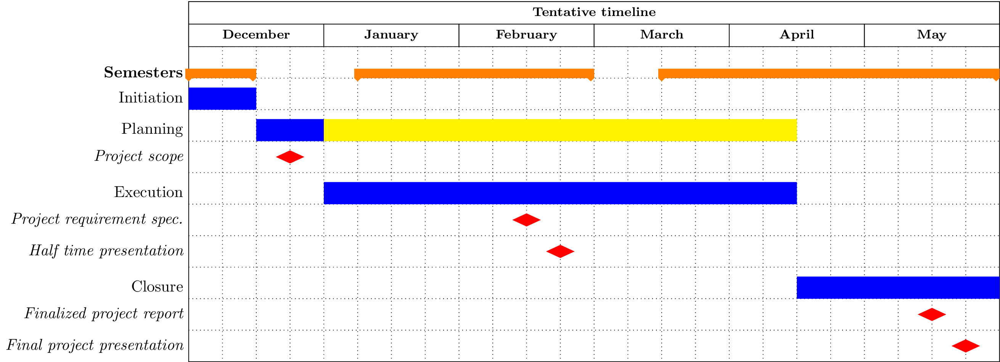

==========================
 TIMELINE AND METHODOLOGY
==========================

   An overview of our waterfall project plan. The red dots indicate
   assignment milestones. Since we are using an agile workflow, specific
   tasks are not specified in this chart.

We have adapted a hybrid methodology combining the waterfall model
with an agile workflow, specifically the model SCRUM. Specifically, we
used the waterfall model to outline the main parts of the project,
including initialization, planning, execution and closure phases (see
figure 1). During the execution phase we temporarily leave the
waterfall model, instead working in an agile manner using SCRUM.

We decided to keep the phase involving only planning rather short in
favor of the execution phase which involves a lot of planning,
adapting and follow-up according to the agile workflow (see the yellow
part of the planning phase in figure 1). This decision was made based
on the rather research heavy nature of this project. We deem it more
effective to start research and experimenting sooner rather than later
to acquire as much knowledge as possible about the area as fast as
possible.

Sprints
-------

Before and during the execution phase we will define all tasks that
should be done in our project backlog. Every 2 weeks initialize a new
sprint where we specify which tasks should be executed during that
period, splitting each item into smaller sub-items manageable by an
individual member and assigning each to a member of the group. The
decision to have 2 week sprints was made in order to have enough time
to execute the tasks, since we have other courses parallel with this
project.

When a sprint is over we review the sprint during a meeting to find
out what tasks were finalized and what didn’t go as planned. We also
perform checkups during sprints every other day, where each member
reports their progress and we discuss the direction of the
sprint. These bidaily checkups are performed in our slack
channel. Additionally we keep continuous contact both with each other
in the development team and with representatives from Flightradar24.

We are using Trello to keep track of tasks in an agile
manner. Bitbucket is the repository management website used by
Flightradar24, which we are using conjunction with git to perform
version control.

Development guidelines
----------------------

In order to enable a smooth development process, we have composed a
set of development guidelines for all members to follow. This
encompasses a git workflow with a specific branching model and
guidelines for code formatting, documentation and unit testing.

Gitflow
~~~~~~~

Firstly, the git model employed is the gitflow model. In this model,
the master branch is used as a platform for stable versions, in
principle ready for shipping, while a development branch is used for
the current version of the code. The code on the development branch is
kept in a working state although it is not required to be bug
free. All new features are pushed to feature branches which are merged
into the development branch after peer review.

Formatting
~~~~~~~~~~

To prevent discussions about code formatting, which threaten to take
time from important discussions about problem solving and solutions,
we use a code formatter called Black. All code pulled to the
development branch has to comply with the formatting requirements of
Black.

Project documentation
~~~~~~~~~~~~~~~~~~~~~

To integrate our project documentation with the code and make it
traceable in our version control software, we will use Sphinx
documentation software and documentation, including docstrings in the
code, in the reStructuredText format. Sphinx will compile the
documentation to LaTeX. We are in the process of merging our
documentation to reStructuredText and Sphinx.
