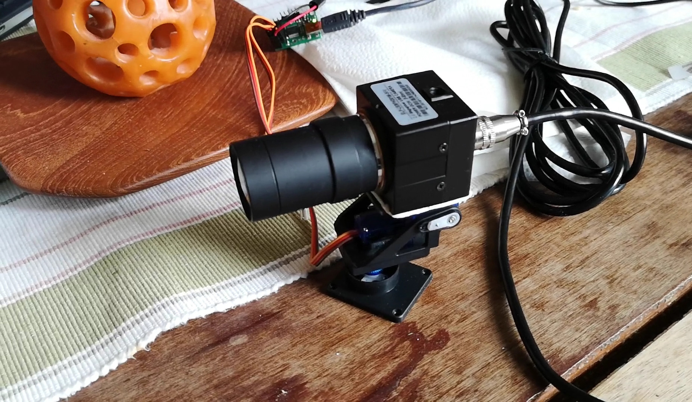
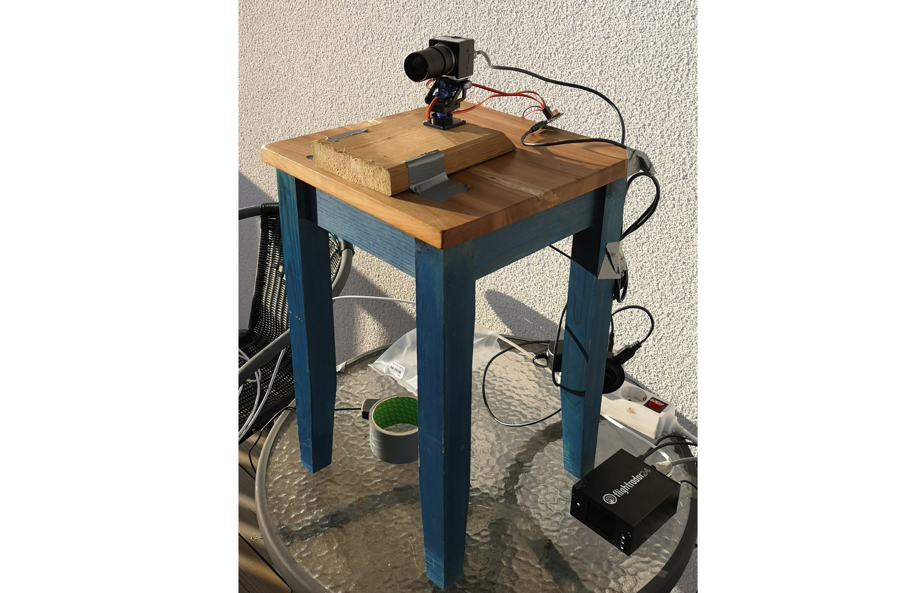
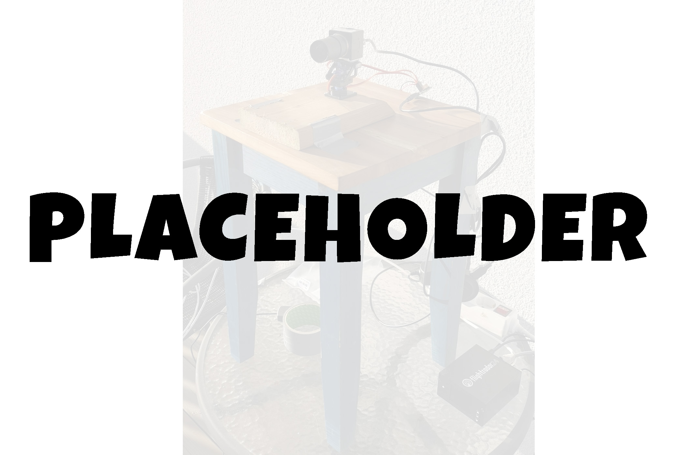

==============
 DEVELOPMENT
==============

#############
Changelog
#############

The changelog briefly summarizes all the development on the product,
when requirements were satisfied and when changes were made in the requirements.

Sprint 1 (15/1 - 22/1)
--------
- Researched viable hardware to see what options were available
- Ordered hardware (two servos, a servo controller and a camera)
- Put up a Trello board and a Slack channel

Sprint 2 (22/1 - 4/2)
--------
- Decided on a git workflow
- Researched the preexisting Skysense software
- Made a coordinate converter to convert the coordinates in the Skysense to a usable format
	-  Satisfied :need:`FREQ_22`, :need:`FREQ_8`
- Received and tested the pan/tilt-platform

   Our first setup using the pan/tilt-platform, the servo and the camera

Sprint 3 (4/2 - 15/2)
--------
- Worked abstractly on methods to handle multiple aircraft and calculate which aircraft was in view
	- Partly satisfied :need:`QREQ_6`
- Wrote code to extrapolate upcoming positions of an aircraft based on previous positions
	- Satisfied :need:`FREQ_13``
- Wrote code to convert from coordinates to a direction to point the camera
	- Satisfied :need:`FREQ_10`, :need:`FREQ_11`
- Learned how to control the pan/tilt-servos using an open source python library
	- Satisfied :need:`QREQ_8`
- Discussed software license with Flightradar24

Sprint 4 (15/2 - 4/3)
--------
- Researched software that would be able to stream webcam footage to a web server
- Wrote code to parse the airplane data file to usable data within the program
- Made improvement to the code converting coordinates
- Managed to control the pan/tilt-servos directly from the Skysense hardware

Sprint 5 (4/3 - 19/3)
--------
- Mounted the camera onto the platform
- Made a program to stream video from the camera
	- Satisfied :need:`FREQ_2`
- Made a program to control the pan/tilt-servos
   - Satisfied :need:`FREQ_7`
- Made a program to control the camera filming
	- Satisfied :need:`FREQ_15`, :need:`FREQ_16`
- Made a simple interface to show the video that was being streamed
	- Satisfied :need:`FREQ_5`
- Wrote tests for all of the finished code
- Split the program to work in multiple threads

   The first functional setup in action filming actual airplanes

Sprint 6 (19/3 - 4/4)
--------
- Created a basic config file which held the directional angle for the camera and the accepted view angles
	- Satisfied :need:`FREQ_18`, :need:`FREQ_19`
- Researched stream services
- Changed :need:`FREQ_17` and :need:`FREQ_19`

Sprint 7 (4/4 - 9/5)
--------
- Tweaked plane selection to only select planes when they are within a certain distance
	- Satisfied :need:`QREQ_6`, :need:`FREQ_12`
- Ordered some new hardware (platform and servos) in an attempt to get less shaky and more precise video output
- Installed the new hardware and calibrated the software to work with the new servos
- Made improvements to the configuration file to include stream settings
- Implemented a feature to display the aircraft id with the video stream on the web interface
- Changed :need:`QREQ_4`

   The final hardware setup

#############
Development Decisions
#############

Explanations and critique of the development decisions.

Hardware
--------
During the first sprint the camera was decided based on price,
size and ability to film in a quality that is good enough for the requirements.

The initial servos were chosen because they were thought to be strong enough and the price was low.
The first servos proved to be too weak to efficiently handle the weight of the camera,
so new servos and a new platform were ordered and mounted. They were of a stronger model and partially
solved the problems with previous servos. The new servos gave us less shaky video footage but
were still a bit shaky when tilting up and down.

The servo controller was chosen to make sure that it would be compatible
with any servo hardware and work on the Skysense Linux system.

Software
--------
Python was chosen for writing the main program, since that was suggested by
Flightradar24 and since it was thought to cover the needs, which it did.

Initially there was a focus on streaming video to a local server instead of streaming
to a cloud service provider (AWS) to quickly have a working Proof of Concept.
That resulted in a lot of time spent on researching different web streaming technologies
that weren't really what Flightradar24 requested. It would have been wiser to study
AWS services from the start, since time was very limited at the end of the project.
In the end it was decided to stick with streaming to a local web server since it was
considered to be good enough for the proof of concept.

#############
Requirement Verification
#############

All requirements of the highest priority were satisfied, however, some of them were
slightly modified over the development process. Some of the lower priority
requirements were not satisfied for various reasons.

The following requirements were partially changed during development:

- :need:`QREQ_4`:

  Initially the plan was to not film airplanes that were moving away from the camera,
  and instead focus on the ones approaching the camera. However, after discussing it with
  Flightradar24 it was decided that it would be effective enough to just film
  airplanes while they're within a certain radius.

- :need:`FREQ_17`:

  The idea of how the view would be configurable was initially more focused on ease of use,
  and to avoid the need of access to files on the Skysense.
  However, after discussing it with Flightradar24, it was settled to be configurable
  through a config file on the Skysense.

- :need:`FREQ_19`:

  Initially the plan was to have a way of configuring through some more sophisticated process,
  such as configuring the settings through a website. The requirement was later changed to accept
  that the process was simply to edit a config file.

The following lower priority requirements were not satisfied:

- :need:`FREQ_3`:

  Some effort was put in to researching the use of Amazon Kinesis (a video streaming service provided by AWS)
  to distribute the video stream. The process of streaming video footage to with Kinesis turned out to be
  quite complicated. It definitely appeared to be doable but due to time constraints other things were prioritized.

- :need:`FREQ_4`:

  This requirement was dependent on :need:`FREQ_3`.

- :need:`FREQ_6`:

  This requirement was dependent on :need:`FREQ_3`.

- :need:`FREQ_21`:

  This requirement was dependent on :need:`FREQ_3`.

- :need:`FREQ_14`:

  No good way of doing this was found in the available time. An option that was considered was
  reading the pixels on the screen to measure light level, but the streaming feature used did not allow to do this easily.
