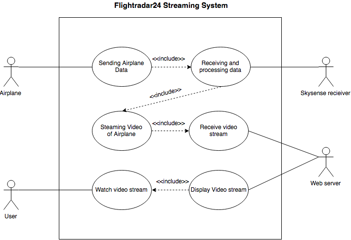

INTRODUCTION
############

==========
 The Team
==========

Developers
----------

* Markus Wesslén - Local product owner

* Anders Thuné - Scrum master

* Adam Wiker - Documentation responsibility

* Christian Stjernberg - Hardware responsibility

* Joakim Loxdal - Frontend responsibility

* Måns Andersson - Backend responsibility

* Philip Andersson - Cloud responsibility

* Theo Puranen Åhfeldt - Testing responsibility

Roles
-----

* Local product owner

The product owner is responsible for managing the project backlog,
defining the product in parts and prioritizing them based on
importance. The role also includes ensuring that the project backlog
is visible and easy to understand for everyone involved. This includes
communicating the development process and status with Flightradar24 to
ensure that the development is in line with their expectations.

* Scrum master

The Scrum master is responsible for the project’s process and
directing the biweekly sprint meetings. They coach the team and make
sure the members work productively and follow the practices of
scrum. In practice, this primarily means performing bidaily Slack
checkups and coordinating the workflow on Trello.

The remaining roles each entail a responsibility within a certain area
of the project. While all members cooperate to perform the tasks
needed, the member responsible for a given area is expected to pay
extra attention to that part of the project.

==========
 The Need
==========

Different services allow consumers to obtain information about traffic
jams, train time tables, flights, et cetera, to an ever growing
extent. One such service is Flightradar24’s flight tracking service,
which allows users to track airplanes on a map updated in real
time. The service provides positional data, flight numbers and similar
statistics and is popular among flight enthusiasts around the
world. However, one potential feature which the company has yet to
implement is to show footage of the airplanes along with the other
statistics. By providing footage of the airplanes passing by, lifting
and landing, the service could be made even more engaging for a wide
range of users.

===============
 Proposed Idea
===============

The idea is to make a proof-of-concept product to automatically
live-stream airplane traffic (and takeoff/landing) using a pan-tilt
camera connected with Flightradar24’s receiver unit called the
Skysense v2 (See Skysense v2 for more info). This will give airplane
enthusiasts the ability to watch their favorite aircrafts live from
the comfort of their home. The project will use positional information
that is sent from the aircraft, received through an antenna, (this
data gathering is already implemented in the software of the Skysense
v2) in order to know where to aim the camera. We will not track
take-offs and landings initially, but instead let volunteers (that
already have Skysense v2 equipment) put the device in their window and
film planes during flight which will be livestreamed to the
Flightradar24 platform.

   Use case diagram showing an overview of the system and actors

=================
 Project Summary
=================

This is a project within the course Software Engineering for the
client Flightradar24 AB. The primary project goal is to create a
prototype automatically capturing airplane footage, with a connected
web interface that the prototype can stream video to. If Flightradar24
is pleased with the prototype and its functionality they may want to
continue the development and create a final product which can be
delivered to customers. This means that our requirements need to be
applicable to a final product even though the primary goal of the
project is to deliver a prototype. We may only fulfill a subset of the
requirements for our prototype but we need to keep in mind that no
requirement shall be unsatisfiable, allowing further development to
take place.
