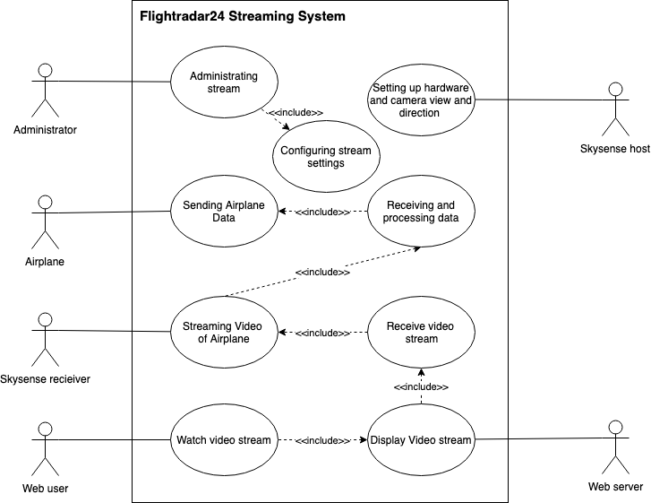

INTRODUCTION
############

==========
 The Team
==========

Developers
----------

* Markus Wesslén - Local product owner

* Anders Thuné - Scrum master

* Adam Wiker - Documentation responsibility

* Christian Stjernberg - Hardware responsibility

* Joakim Loxdal - Frontend responsibility

* Måns Andersson - Backend responsibility

* Philip Andersson - Cloud responsibility

* Theo Puranen Åhfeldt - Testing responsibility

Roles
-----

* Local product owner

The product owner is responsible for managing the project backlog,
defining the product in parts and prioritizing them based on
importance. The role also includes ensuring that the project backlog
is visible and easy to understand for everyone involved. This includes
communicating the development process and status with Flightradar24 to
ensure that the development is in line with their expectations.

* Scrum master

The Scrum master is responsible for the project’s process and
directing the biweekly sprint meetings. They coach the team and make
sure the members work productively and follow the practices of
scrum. In practice, this primarily means performing bidaily Slack
checkups and coordinating the workflow on Trello.

The remaining roles each entail a responsibility within a certain area
of the project. While all members cooperate to perform the tasks
needed, the member responsible for a given area is expected to pay
extra attention to that part of the project.

==========
 The Need
==========

Different services allow consumers to obtain information about traffic
jams, train time tables, flights, et cetera, to an ever growing
extent. One such service is Flightradar24’s flight tracking service,
which allows users to track airplanes on a map updated in real
time. The service provides positional data, flight numbers and similar
statistics and is popular among flight enthusiasts around the
world. However, one potential feature which the company has yet to
implement is to show footage of the airplanes along with the other
statistics. By providing footage of the airplanes passing by, lifting
and landing, the service could be made even more engaging for a wide
range of users.

===============
 Proposed Idea
===============

The idea is to make a proof-of-concept product to automatically
live-stream airplane traffic (and takeoff/landing) using a pan-tilt
camera connected with Flightradar24’s receiver unit called the
Skysense v2 (See :ref:`hardware` for more info). This will give airplane
enthusiasts the ability to watch their favorite aircrafts live from
the comfort of their home. The project will use positional information
that is sent from the aircraft, received through an antenna, (this
data gathering is already implemented in the software of the Skysense
v2) in order to know where to aim the camera. Take-offs and landings
will not be tracked initially. Instead volunteers (that
already have Skysense v2 equipment) will put the device in their window and
film planes during flight which will be livestreamed to the
Flightradar24 platform.

==========
User Scenarios
==========
Our user scenarios explain how all different users will interact with our proof of concept.

   Use case diagram showing an overview of the actors and their respective use cases

Web User Scenario
---------------
The web user is a Flightradar24 end consumer, interested in live data about flights.
They will visit a streaming site via a url to view live footage of all current streaming flights.

Skysense host scenario
------------
The Skysense host is the person hosting the Skysense receiver and camera setup.
All of the required software for the camera setup is already on the Skysense.
The owner needs to access the Skysense remotely and edit the config file.
They will have to set the compass angle based on the orientation in which they placed their
camera setup. If is also possible to limit the maximum view angles for privacy
or other reasons.

Flightradar24 Administrator Scenario
------------
The Flightradar24 administrator is an employee at Flightradar24 working with Skysense hosts.
They will easily install software on the Skysense before it is sent to a Skysense host.
The process of installing software is documented in a README-file and includes connecting to the
Skysense remotely and running a Python script that installs dependecies. The administrator also
configures the stream settings and manages the web server receiving the video data.

==========
Risk Analysis
==========

Risks are continously analysed in different parts of the
development process and a few risks were identified:

- Hardware
A potential risk would be that hardware ordered didn't
meet the criterias of the product.
That could be if the servo would not be able to hold the camera,
or if ordered parts were missing in the received package.
Another risk could be that our different hardware components wouldn't be compatible with each other.
That could be if the camera or servo controller wouldn't be accepted by the Skysense.
To cope with these risks, all hardware that would be ordered had to be thoroughly researched.

- Streaming solution
A risk would be not being able to find a working streaming solution
fitting the request from Flightradar24. To handle that time
had to be planned well and a backup PoC streaming solution (not on cloud platform) should be researched.

- Lack of time
Since all members of the team have courses running in parallell with the
software project, the time constraints may lead to certain parts of the project not succeeding.
The solution to this problem would be planned meetings and working group communication.
