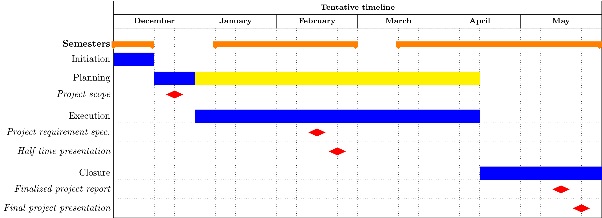

==========================
 TIMELINE AND METHODOLOGY
==========================

   An overview of our waterfall project plan. The red dots indicate
   assignment milestones, orange indicates school semesters and blue
   and yellow indicate project phases. Since an agile workflow was
   used, specific tasks are not specified in this chart.

A hybrid methodology was adapted combining the waterfall model
with an agile workflow, specifically the model SCRUM. Specifically, a
waterfall model was used to outline the main parts of the project,
including initialization, planning, execution and closure phases (see
figure 1). During the execution phase the waterfall model was temporarily left,
instead working in an agile manner using SCRUM.

The decision was made to keep the phase involving only planning rather short in
favor of the execution phase which involves a lot of planning,
adapting and follow-up according to the agile workflow (see the yellow
part of the planning phase in figure 1). This decision was made based
on the rather research heavy nature of this project. It was deemed to be more
effective to start research and experimenting sooner rather than later
to acquire as much knowledge as possible about the area as fast as
possible.

Sprints
-------

Before and during the execution phase all tasks that
should be completed were defined in our project backlog. Every 2 weeks, a new sprint
was initialized and relevant tasks which should be executed during that
period was identified and specified. The tasks were split into smaller sub-tasks
manageable by an individual member, which were then assigned to one or more
members of the team. The decision to have 2 week sprints was made in order to
have enough time to complete the tasks, since other courses run in parallel with
the project. The sprint duration sometimes exceeded 2 weeks,
this was mostly due to interference from other courses.

When a sprint was over the sprint was reviewed during a meeting to find
out what tasks were finalized and what didn’t go as planned.
Checkups in Slack were made during sprints every other day,
where each member reported their progress.
Additionally continuous contact was kept, both with each other
and with representatives from Flightradar24 in their Slack workplace.

Trello was used to keep track of tasks in an agile
manner. Bitbucket is the repository management website used by
Flightradar24, which was used in conjunction with git to perform
version control.

Development Guidelines
----------------------

In order to enable a smooth development process, a
set of development guidelines for all members to follow was used. This
encompasses a git workflow with a specific branching model and
guidelines for code formatting, documentation and unit testing.

Gitflow
~~~~~~~

Firstly, the git model employed was the gitflow model. In this model,
the master branch is used as a platform for stable versions, in
principle ready for shipping, while a development branch is used for
the current version of the code. The code on the development branch is
kept in a working state although it is not required to be bug
free. All new features are pushed to feature branches which are merged
into the development branch after peer review.

Formatting
~~~~~~~~~~

To prevent confusion about code formatting, which threaten to take
time from important discussions about problem solving and solutions,
a code formatter called Black was used. All code pulled to the
development branch has to comply with the formatting requirements of
Black.

Project documentation
~~~~~~~~~~~~~~~~~~~~~

The report was written using the reStructuredText format.
Sphinx was used to convert the report to a LaTex version which was
then compiled to a pdf file.

Code documentation was written with docstrings, and Sphinx
is used to combine all code documentation into an easily overviewed document
which will be sent to Flightradar24.
