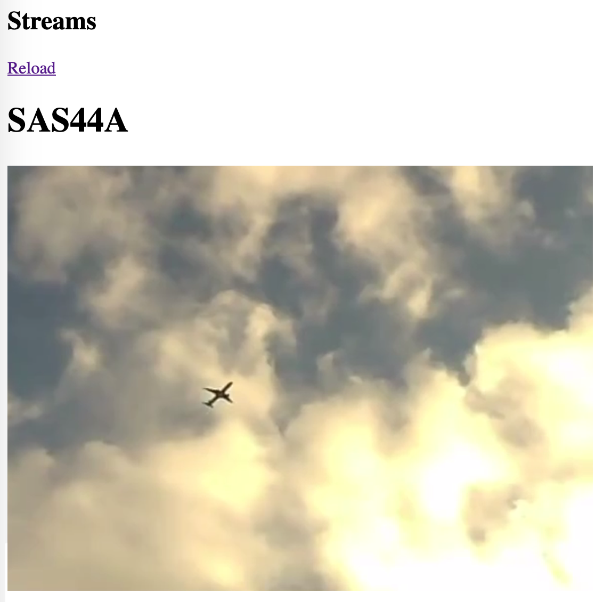

==============
 SOLUTION
==============

This section begins with a description of the hardware and the software
used in the final solution. This is followed by a complete overview of the
entire system.

Material
--------

Hardware
~~~~~~~~

- **Skysense v2**

  The Skysense v2 is a custom receiver with an industrial grade
  Raspberry Pi under the hood. It is the newest receiver used by
  Flightradar24. It has 4 IO-connectors: Ethernet, USB, GPS and ADS-B antenna.
  GPS and ADS-B data are received through the antennas.
  The Ethernet port is used for communication between the Skysense v2 and
  Flightradar24’s network.

- **Pololu Micro Maestro 6-Channel USB Servo Controller**

  The Maestro is used to control the servos in the pan/tilt-platform
  over USB. An open source python-library is used to
  communicate with the Maestro from the Raspberry Pi.

- **ELP 5-50mm Varifocal Lens 1080P**

  This is the webcam used in the product. It has a manual zoom
  capability.

- **2 DOF Pan Tilt Platform**

  This is a pan-tilt platform assembled with two MG996 servos.

- **UGREEN USB Hub Super Speed 4**

  This is a USB Hub used to for communication between the Skysense and the
  camera and pan-tilt platform.

Software
~~~~~~~~

- **Python**

  The backend, control-flow and data processing is done in Python 3.5.

- **Python Module Numpy**

  Trigonometric functions, least squares solvers and many other useful
  functions. The module is open source, under a license permitting
  modification and commercial use. The module is used for the calculations and
  data processing in the backend of the product.

- **Python Module Maestro**

  Maestro is used to control the micro servo controller from Python. The
  source code is under MIT-license which means it can be used without any restrictions.

- **NodeJS Web Server**

  To host the frontend live stream page a NodeJS web server with some common web
  technology (HTML/CSS/JavaScript) is used.

- **Camera Streaming Software FFmpeg**

  The camera streaming software is FFmpeg. It's an open source
  library for simple camera control and streaming.

Solution Design
---------------

In short, the product takes input from the antennas and will, if an airplane
is visible, produce a video stream.

Before running the software, the user has to manually enter the compass angle
that the camera is facing, as well as bounds that define a virtual view which
limits the angles the camera can turn. When running, the software constantly
receives positional data from nearby airplanes via the antennas. The Skysense
can receive data from multiple airplanes simultaneously. Airplanes that are out
of view, (outside the bounds defined by the user), are filtered out. If there are any
remaining airplanes, an arbitrary one is selected and the stream is started.
A more sophisticated approach could be to rank the airplanes based on different
attributes, and pick the best one. The selected airplane's position is
thereafter continually processed and translated to angles, which are sent to
control the servo and aim the camera at the airplane. Once the airplane goes out
of view the stream is stopped, and the software waits for an airplane to enter
the view again before starting another stream again. This process is illustrated
in the diagram.

   An activity diagram explaining the software running on the Skysense

Interface Description
~~~~~~~~~~~~~~~~~~~~~

The interface to the product consists of two things:

* The configuration file

The config file is used for setting up upper, lower, left and right angle bounds
as well as view distance and direction.

* The web page receiving the stream

The web page will display a stream when an airplane is
"visible" for it. I.e. when an airplane is within the viewing
range chosen in the configuration process.

   The configuration file

   Our web page interface
